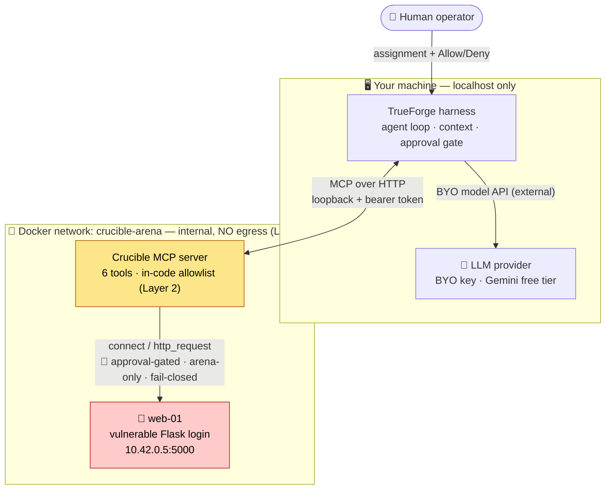
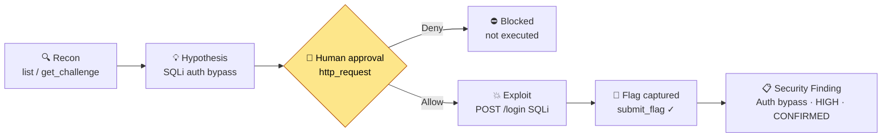

<div align="center">

# 🛡️ The Crucible

### A safety-first **autonomous security-validation agent**, built on TrueForge

*Hand it a controlled, vulnerable target. It investigates, forms a hypothesis, and then **stops and
asks a human to authorize** the one action that touches the live target — executes it, captures the
flag as evidence, and produces a **security finding**.*


**The Agent Harness Hackathon** · WeMakeDevs × TrueFoundry × Qodo × OpenAI · Track: **Best Use of TrueForge**

</div>

---

## ⚡ In one glance

An LLM that *suggests* an exploit is easy. An agent that **actually runs one** — safely — is the hard
problem, and it's the whole product. The Crucible does real autonomous security work while every
dangerous action stays inside **enforceable technical and human boundaries**:

- 🧠 **Autonomous** — it does its own recon, forms a vulnerability hypothesis, and drives the exploit.
- 🛑 **Human-gated** — TrueForge **pauses** before the one action that touches the live target
  (`connect` / `http_request`) and blocks until a person clicks **Allow**. *"License to Hack."*
- 🔒 **Contained in code, fails closed** — a two-layer network boundary (arena-only Docker network +
  an in-code allowlist) that no prompt can talk its way around. **9/9 arena checks, 40/40 tests.**
- 🎯 **Real result** — it lands the SQL-injection auth bypass on `web-01`, captures
  `crucible{…}`, validates it server-side, and emits a structured **security finding** — not "flag found."
- ✅ **Every change Qodo-reviewed** across 10 PRs; direct pushes to `main` are never used.

> **Remove TrueForge and the architecture collapses:** the harness *is* the agent loop, the MCP tool
> routing, and — critically — the human-approval gate. (Its sandbox-as-tool is available too; we keep
> it off by default — see the security model — and route every live action through allowlisted tools.)

---

## 🏗️ Architecture



**How the pieces fit**
- **TrueForge** runs the agent loop on the host and mediates every tool call — including the
  **approval pause**. The model is BYO (any provider); we use free-tier `gemini-3.5-flash-lite`.
- **The Crucible MCP server** is the *only* path from the agent to the arena. It's served over
  Streamable HTTP (loopback-only + bearer token) and sits on the arena's internal Docker network so
  it can reach targets — while its in-code allowlist (`connect` / `http_request`) rejects anything
  off-arena, **in code, fail-closed**.
- **The arena** is self-owned, intentionally-vulnerable infrastructure on an `internal: true` Docker
  network with **no route to the internet**. The agent can't reach anything we don't own.

## 🔄 A Security Case (what a run looks like)



*Verified live end-to-end:* recon → **approval pause** → authorized `http_request` →
`{"flag":"crucible{sqli_auth_bypass_web01}"}` → `submit_flag` `correct:true` → security finding.

---

## 🏆 Why this wins (mapped to the judging criteria)

| Criterion | How The Crucible answers it |
|---|---|
| **Potential impact** | Autonomous vulnerability triage/validation is real, valuable security work (bug-bounty triage, pre-prod validation, security education) — not a toy. |
| **Creativity / originality** | A safety-first *security-validation agent* — a distinctive, high-signal domain, not another chatbot/dashboard. |
| **Technical excellence** | Custom MCP server (6 zod-typed tools), Streamable-HTTP transport, defense-in-depth network containment with anti-DNS-rebinding, server-side flag validation — **40 tests + 9 arena checks**. |
| **Use of sponsor tools** | **TrueForge is load-bearing** — MCP routing and the human-approval gate (sandbox-as-tool available, off by default for containment); remove it and the safety model collapses. **Qodo** reviewed all 10 PRs. |
| **Control & safety** | The whole premise is safety-critical (an LLM runs exploit code). The approval gate + code-enforced, fail-closed boundary are **real, tested controls** — not disclaimers. |
| **Presentation** | The approval pause, a live controlled exploit, and a network-boundary **rejection** are inherently dramatic and on-theme with the "License to act / 007" framing. |

---

## What it is

The Crucible is an autonomous agent for **security validation**: given a controlled, intentionally
vulnerable target, it determines whether a suspected vulnerability is genuinely exploitable and
writes up a finding. The flagship target, `web-01`, is a Flask login with a classic SQL-injection
auth bypass (`admin'--`). The agent runs recon, hypothesizes, and — only after a human authorizes —
sends the exploit and captures the flag as evidence. The output is a **security finding**, not a game
score. The CTF-style arena is just the *safe evaluation environment*, never the product.

## Why it exists

The dangerous part of "an agent that hacks" isn't the hacking — it's making sure the agent's code is
contained and that it *stops before acting*. The Crucible is a working answer: meaningful autonomous
security work where the two things that could go wrong — reaching something you don't own, and acting
without authorization — are both **prevented in code and by a human gate**, not by hoping the model
behaves. That boundary is the product.

## 🤝 TrueForge integration (load-bearing)

| Requirement | TrueForge capability | The Crucible's use |
|---|---|---|
| Reach real tools | MCP client | The Crucible MCP server: the only path to the arena |
| Stop before irreversible action | **Human approval** | Pause before `connect` / `http_request` (the "License to Hack") |
| Safe place to run generated code | Sandbox-as-tool | Available; off by default (standalone can't lock sandbox egress — see §3a) |
| Any model | Model providers | BYO key; free-tier `gemini-3.5-flash-lite`; OpenAI-compatible (Groq) supported |
| Survive reconnects | Sessions | A Security Case is a persisted TrueForge session |
| Delegate (optional) | Subagents | A harness capability; **not wired up** here (design recorded in `PROJECT_DECISIONS.md` D17, currently disabled) |

Full detail: [`docs/TRUEFORGE_INTEGRATION.md`](docs/TRUEFORGE_INTEGRATION.md).

## 🔐 Security model & network boundary

The Crucible deliberately drives real exploit traffic, so containment is the whole point. The
boundary is enforced **in code, in two independent layers**, and **fails closed**:

- **Layer 1 — arena network egress.** The arena is an `internal: true` Docker network with **no
  route to the internet**. Proven on the real network by `verify-arena.sh`: a container on the arena
  net reaches `web-01` but **cannot** reach `example.com` or `8.8.8.8`.
- **Layer 2 — in-code allowlist.** `connect` and `http_request` resolve the destination, validate
  **every** resolved address against the arena subnet, **pin** the IP (anti-DNS-rebinding), and act
  only against an approved arena target — rejecting public IPs, loopback, private/link-local ranges,
  IPv6, malformed input, and alternate encodings.

The MCP endpoint itself is hardened (loopback-only, bearer-token auth, DNS-rebinding Host validation,
bounded bodies). `fetch_file` enforces ownership + path-traversal + symlink-escape checks;
`submit_flag` validates server-side with a constant-time compare. Full detail + threat model:
[`docs/SECURITY_MODEL.md`](docs/SECURITY_MODEL.md).

## 🚀 Quickstart

**Prereqs:** Node 20+, Docker, and a model API key (free-tier Gemini works).

### Running the arena
```
# stand up the self-owned, intentionally vulnerable targets + the MCP server
docker compose -f arena/docker-compose.yml up -d --build --wait

# one-command health + containment check (reachability, exploit, Layer-1 egress, tool path)
bash arena/verify-arena.sh          # expect 9/9

# tear down when done
docker compose -f arena/docker-compose.yml down
```

### Running the MCP server (directly, for dev/test)
The MCP server comes up **with the arena** (the `mcp` service) at `http://127.0.0.1:8848/mcp`
(loopback-only; health at `/health`). To run/test it on its own:
```
cd mcp-server
npm install
npm run typecheck     # tsc strict + noUncheckedIndexedAccess
npm test              # 40 tests: fail-closed policy + in-process MCP + HTTP transport + tools
npm run start:http    # serve over Streamable HTTP (or `npm start` for stdio)
```

### Running TrueForge + wiring the agent
```
npx @truefoundry/trueforge                    # harness UI + API at http://localhost:8790

# register the connector, configure a model (BYO key), and create the agent (idempotent):
TF_MODEL_API_KEY=<your key> MODEL_PROVIDER=google-gemini \
  MODEL_ID=gemini-3.5-flash-lite MODEL_NAME=gemini-3-5-flash-lite \
  node scripts/trueforge-setup.mjs
```
`gemini-3.5-flash-lite` runs on Gemini's **free** tier. The script sets
`require_approval_for_tools: ["connect", "http_request"]` (the "License to Hack" gate). Full guide:
[`docs/TRUEFORGE_SETUP.md`](docs/TRUEFORGE_SETUP.md); OpenAI-compatible providers (e.g. Groq) via
`MODEL_BASE_URL`.

### Running a Security Case
Open the chat UI at `http://localhost:8790`, pick `crucible-agent`, and give it:
> *"Investigate web-01 and determine whether authentication can be bypassed. Investigate freely,
> but ask me before you execute anything against the live target."*

Expected arc: recon → hypothesis → **approval pause on `http_request`** → authorize → exploit →
`submit_flag` → security finding. Beat-by-beat demo script:
[`docs/DEMO_SHOTLIST.md`](docs/DEMO_SHOTLIST.md).

## 🧪 Testing
```
# MCP server: fail-closed network policy, in-process MCP, HTTP transport, tools (40 tests)
cd mcp-server && npm run typecheck && npm test

# Arena + Layer-1 containment + the http_request tool path (9 checks) — needs Docker
bash arena/verify-arena.sh
```
The security boundary is not "done" until the fail-closed matrix in
[`docs/SECURITY_MODEL.md`](docs/SECURITY_MODEL.md) §6 passes and both layers are proven. Current
status: **40/40 unit/integration tests, 9/9 arena checks.**

## Qodo Code Review Evidence
Every substantive change in this repo goes through a GitHub pull request reviewed by Qodo before
merge; direct pushes to `main` are not used. Each PR shows an initial Qodo review, our fixes or
recorded dismissals, and a follow-up review of the final code. Setup + per-PR workflow:
[`docs/QODO_SETUP.md`](docs/QODO_SETUP.md).

**Representative reviewed PRs**
- [PR #1 — Foundation](https://github.com/Rigur-Calypso/Crucible/pull/1) (merged): arena, MCP
  server, two-layer security boundary.
- [PR #2 — Address Qodo review](https://github.com/Rigur-Calypso/Crucible/pull/2) (merged):
  correctness + robustness fixes.
- [PR #3 — TrueForge integration](https://github.com/Rigur-Calypso/Crucible/pull/3) (merged): HTTP
  MCP transport, containerized MCP on the arena network, agent + approval wiring.
- [PR #7 — Exploit tool](https://github.com/Rigur-Calypso/Crucible/pull/7) (merged): the
  approval-gated `http_request` that captures the flag.

**What Qodo surfaced and what we did (examples)**
- *Security (PR #3, High/Med).* Qodo flagged that the new Streamable-HTTP MCP endpoint was
  published on all host interfaces, unauthenticated, with unbounded request bodies. We bound it to
  **loopback only**, added **bearer-token auth**, enabled **DNS-rebinding Host validation**, and
  **capped body size (413)**. Its re-review went from 5 bugs + 5 rule-violations to **0 bugs**.
- *Correctness (PR #1, High).* Qodo caught that `connect` reported success without opening a
  socket. We made it perform **real TCP I/O to the pinned resolved IP** (anti-rebinding) and report
  the true outcome — with tests for the reachable / unreachable / blocked paths.
- *Reliability (PR #7, bug).* Qodo caught that `http_request` treated a **reset/partial response as
  success**. We now reject on a premature close and only succeed on a complete response.
- *Dismissed with recorded reason (PR #2).* Qodo suggested an in-code approval gate inside the
  tool. We **declined in-thread**: an MCP tool cannot hold trustworthy approval state (the agent
  controls its inputs), so approval is enforced by TrueForge's harness-level gate — while the network
  allowlist stays enforced in code.

**Review trail:** the PR history shows the full loop on each change — initial review, our per-finding
response (fix or justified dismissal in the thread), and a follow-up review of the pushed code. Every
valid High was fixed. See [`PROJECT_WORKLOG.md`](PROJECT_WORKLOG.md).

## AI-assisted development disclosure
This project was built with AI coding assistance (Claude Code / Claude). AI tools were used for
implementation, documentation, and review support. All submitted code is understood by the team and
can be explained during judging. Design and code were produced during the hackathon window.

## Limitations (honest caveats)
- **Standalone-only, localhost.** TrueForge is run in standalone mode (SQLite), kept on localhost —
  not hardened for shared/production use.
- **Agent sandbox is off by default.** Standalone TrueForge can't constrain sandbox egress, so we
  route all target interaction through the allowlisted, approval-gated tools instead (see
  `docs/SECURITY_MODEL.md` §3a). Enabling the sandbox is opt-in, arena-only.
- **One flagship challenge.** `web-01` is fully built and polished; secondary challenges
  (`crypto-01`, `forensics-01`, `pwn-01`) are intentionally out of scope for reliability.
- **Free-tier model variance.** `gemini-3.5-flash-lite` occasionally returns a transient Google 503;
  a second take succeeds (the demo runbook accounts for this).

## Repository map
| Path | What |
|---|---|
| [`PRD.md`](PRD.md) · [`PROJECT_DECISIONS.md`](PROJECT_DECISIONS.md) | Requirements & authoritative decisions |
| [`docs/SECURITY_MODEL.md`](docs/SECURITY_MODEL.md) | Threat model, two-layer boundary, fail-closed matrix |
| [`docs/TRUEFORGE_INTEGRATION.md`](docs/TRUEFORGE_INTEGRATION.md) · [`docs/TRUEFORGE_SETUP.md`](docs/TRUEFORGE_SETUP.md) | How the harness is used + how to run it |
| [`docs/DEMO_SHOTLIST.md`](docs/DEMO_SHOTLIST.md) · [`DEMO_PLAN.md`](DEMO_PLAN.md) | ~3-min demo runbook |
| [`arena/`](arena) | Self-owned vulnerable targets + `verify-arena.sh` |
| [`mcp-server/`](mcp-server) | The MCP server (tools, network policy, tests) |
| [`scripts/trueforge-setup.mjs`](scripts/trueforge-setup.mjs) | One-command connector + model + agent wiring |
